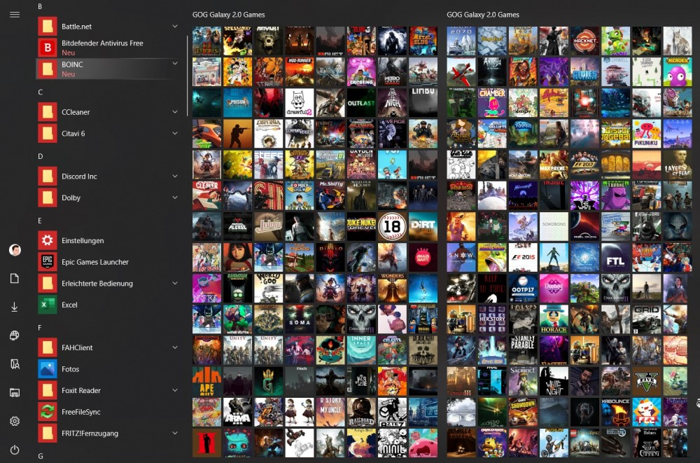

#  GOG Galaxy 2.0 Start Menu Tiles

Main repository at: https://gitlab.com/ChriZ98/gog-galaxy-2-0-start-menu-tiles

[](https://www.gogalaxy.com/en/) [](https://gitlab.com/ChriZ98/gog-galaxy-2-0-start-menu-tiles/-/pipelines) [](https://gitlab.com/ChriZ98/gog-galaxy-2-0-start-menu-tiles/-/releases) [](https://golang.org/) [](https://www.paypal.me/ChriZ98)

This script lets you create Start Menu Tiles of your favourite games in Windows 10! :video_game:

Simply download the `GOG_Galaxy_Start_Menu.exe` from the [Releases section](https://gitlab.com/ChriZ98/gog-galaxy-2-0-start-menu-tiles/-/releases). Your GOG Galaxy 2.0 database will be read and shortcuts will be created in the Programs section. Additionally tiles will be automatically added to the Start Menu, providing a stylish and easy access. :sparkles:

See [Usage](https://gitlab.com/ChriZ98/gog-galaxy-2-0-start-menu-tiles#hammer_and_wrench-usage) for more information on the detailed configuration options.

### Note:
**If you have applied a Start Menu Layout previosly, all changes will be reverted and all tiles will be removed from your Start Menu! This can be the case for computers managed by organizations. The application needs admin rights to create registry keys that add tiles to the Start Menu!**

### Examples:
<table>
  <tr>
    <td></td>
    <td></td>
  </tr>
  <tr>
    <td></td>
    <td></td>
  </tr>
</table>

## :sparkles: Planned Features
* [x] Add build pipeline
* [x] Add custom Start Menu group name setting
* [x] Test whether registry folder exists
* [ ] Create Desktop icons
* [ ] Remember tiles and remove old image files
* [ ] Possibility to choose different icon image source

## :hammer_and_wrench: Usage
```
Usage of GOG_Galaxy_Start_Menu.exe:
  -force
        Force re-download of images.
  -gogDir string
        Path to GOG Galaxy 2.0 data directory. (default "C:/ProgramData/GOG.com/Galaxy/")
  -groupName string
        Name of the Start Menu group.
  -height int
        Defines the rows per group Start Menu Layout. (default 7)
  -hideName
        Show name of game on Start Menu Tile.
  -level string
        Defines log level. (default "INFO")
  -startDir string
        Path for game shortcuts and image data. (default "/Appdata/Roaming/Microsoft/Windows/Start Menu/Programs/GOG.com/GameTiles/")
  -tagName string
        Define a custom tag that defines games to be added to the Start Menu. You can also set it to INSTALLED or ALL to add installed or all games to the StartMenu. (default "StartMenuTiles")
  -tileSize int
        Size of the individual game tiles (1 or 2). (default 2)
  -width int
        Defines the tile count per row in the Start Menu Layout (3 or 4). (default 3)
  -y    Always confirm creation of Start Layout.
```

## :earth_africa: Contributing
If you find any issues or have some improvement ideas, please [create an issue](https://gitlab.com/ChriZ98/gog-galaxy-2-0-start-menu-tiles/-/issues/new). Also feel free to fork the repo and [create a merge request](https://gitlab.com/ChriZ98/gog-galaxy-2-0-start-menu-tiles/-/merge_requests/new) when you have finished your implementation. :page_with_curl:

If your feature is a good addition to the project, it will be merged!

## :package: Dependencies and attributions

* **logrus:** logging library from https://github.com/sirupsen/logrus Copyright (c) 2014 Simon Eskildsen
* **go-sqlite3:** sqlite3 driver from https://github.com/mattn/go-sqlite3 Copyright (c) Yasuhiro Matsumoto
* **Project icon:** Icons made by <a href="http://www.freepik.com/" title="Freepik">Freepik</a> from <a href="https://www.flaticon.com/" title="Flaticon">www.flaticon.com</a>

## :sparkling_heart: Support my projects
If you like the project and you want to support me - please consider to gift using the button below.

[](https://www.paypal.me/ChriZ98)

Thanks! :heart:

## :scroll: License
<table>
  <tr>
    <td><a rel="license" href="http://creativecommons.org/licenses/by-nc-sa/4.0/"></a></td>
    <td><span xmlns:dct="http://purl.org/dc/terms/" href="http://purl.org/dc/dcmitype/Text" property="dct:title" rel="dct:type">GOG Galaxy 2.0 Start Menu Tiles</span> by <a xmlns:cc="http://creativecommons.org/ns#" href="https://gitlab.com/ChriZ98" property="cc:attributionName" rel="cc:attributionURL">Christopher Zinda</a> is licensed under a <a rel="license" href="http://creativecommons.org/licenses/by-nc-sa/4.0/">Creative Commons Attribution-NonCommercial-ShareAlike 4.0 International License</a>.</td>
  </tr>
</table>
