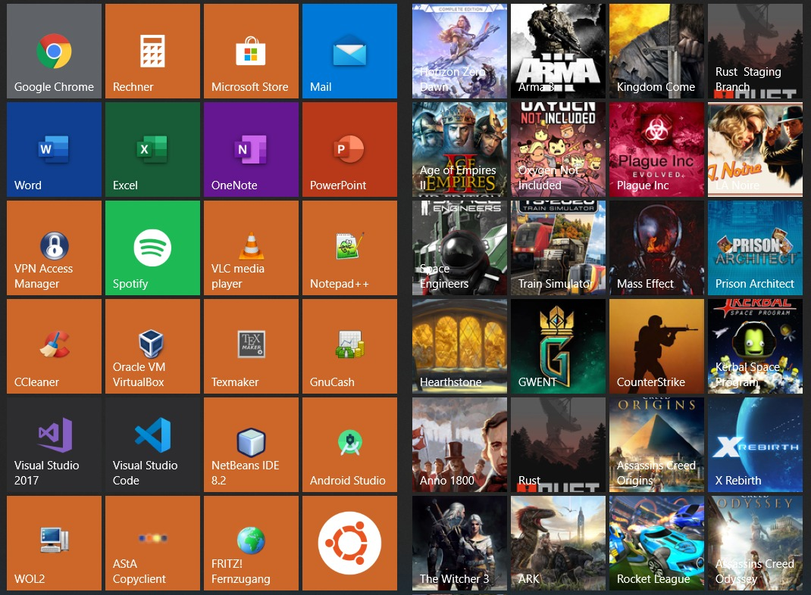
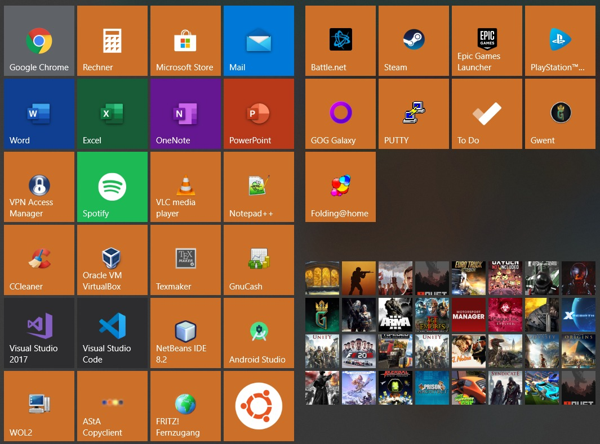

#  WIP: GOG Galaxy 2.0 Start Menu Tiles
[](https://www.gogalaxy.com/en/)     [](https://www.paypal.me/ChriZ98)

## **Disclaimer: This is in a highly experimental stage and might break your Start Menu or your Windows Registry! Use at own risk!**

This script lets you create Start Menu Tiles of your favourite games in Windows 10! :video_game: 

#### Examples:
<table>
  <tr>
    <td></td>
    <td></td>
  </tr>
</table>

## :sparkles: Planned Features
* [ ] Add build pipeline
* [ ] Remember tiles and remove old image files
* [ ] Possibility to choose different icon image source
* [ ] Add custom Start Menu group name setting
* [ ] Test whether registry folder exists

## :hammer_and_wrench: Usage
```
Usage of GOG_Galaxy_Start_Menu.exe:
 -database string
    Path to GOG Galaxy 2.0 database. (default "C:/ProgramData/GOG.com/Galaxy/storage/galaxy-2.0.db")
 -layoutWidth int
    Defines the tile count per row in the Start Menu Layout (3 or 4). (default 3)
 -level string
    Defines log level. (default "INFO")
 -startFolder string
    Path for game shortcuts and image data. (default "/Appdata/Roaming/Microsoft/Windows/Start Menu/Programs/GOG.com/GameTiles/")
 -tileSize int
    Size of the individual game tiles (1 or 2). (default 2)
```

## :earth_africa: Contributing
If you find any issues or have some improvement ideas, please [create an issue](../../issues/new/choose). Also feel free to fork the repo and create a pull request when you have finished your implementation. :page_with_curl:

If your feature is a good addition to the project, it will be merged!

## :sparkling_heart: Support my projects
If you like the project and you want to support me - please consider to gift using the button below.

[](https://www.paypal.me/ChriZ98)

Thanks! :heart:

## :scroll: License
<table>
  <tr>
    <td><a rel="license" href="http://creativecommons.org/licenses/by-nc-sa/4.0/"></a></td>
    <td><span xmlns:dct="http://purl.org/dc/terms/" href="http://purl.org/dc/dcmitype/Text" property="dct:title" rel="dct:type">GOG Galaxy 2.0 Start Menu Tiles</span> by <a xmlns:cc="http://creativecommons.org/ns#" href="https://github.com/ChriZ982" property="cc:attributionName" rel="cc:attributionURL">ChriZ982</a> is licensed under a <a rel="license" href="http://creativecommons.org/licenses/by-nc-sa/4.0/">Creative Commons Attribution-NonCommercial-ShareAlike 4.0 International License</a>.</td>
  </tr>
</table>
